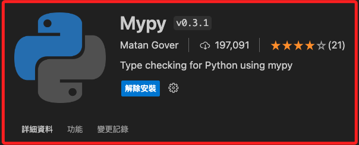
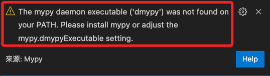
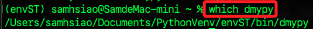
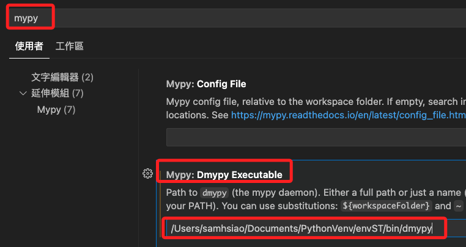

# 類型標註與類型提示

_Type Annotations & Type Hints_

<br>

## 關於 typing

1. Python 在 3.5 版引入了 `typing` 模組，並提供一套標準的 `類型標註工具` 和 `類型`，模組中包括了各種類型構造器如 `List`、`Dict`、`Tuple`、`Set` 等，以及用於創建更複雜類型描述的工具如 `Union`、`Optional`、`Callable` 等。

2. typing 模組是 Python `靜態類型標註` 的核心，用於增強程式碼的可讀性和維護性，並幫助靜態類型檢查工具如 `MyPy` 進行分析。

<br>

## 原生類型構造器 vs. typing 類型構造器

1. 原生的類型構造器，如 `list`、`dict`、`set` 等，主要用於在運行時創建對應的數據結構，不具備類型參數，即不直接支持靜態類型檢查，這些構造器創建的數據結構在運行時是完全動態的，可以在其中存放任何類型的數據。

    ```python
    numbers = [1, 2, 3]  # 原生列表，不指定元素類型
    data = {"name": "Alice", "age": 30}  # 原生字典，不指定鍵和值的類型
    ```

<br>

2. `typing` 模組提供的類型構造器如 `List`、`Dict`、`Set` 等，主要用於 `增強靜態類型檢查` 和改善程式碼的可讀性，這些構造器允許指定容器內元素的類型，從而提供更嚴格的類型檢查和更清晰的程式碼文檔，這些 `類型標註` 在代碼運行時不影響性能，但可以被 `類型檢查器` 如 `MyPy` 用來在開發階段捕捉潛在的錯誤。

    ```python
    from typing import List, Dict, Tuple

    numbers: List[int] = [1, 2, 3]
    data: Dict[str, int] = {"age": 30}
    coordinates: Tuple[int, int, int] = (10, 20, 30)
    ```

<br>

## Type Annotations vs. Type Hints

1. **類型標註（Type Annotations）**：

   - 類型標註是 Python 3.5 引入的功能，允許為變數、函數參數和返回值提供額外的類型信息，這些信息存儲在每個函數或模組的 `__annotations__` 屬性中。

   - 類型標註的初衷是提供一種方式來裝飾函數、參數和其他變數，以說明它們的類型，_不僅限於類型提示_，也可以包含其他形式的資訊。

<br>

2. **類型提示（Type Hints）**：

   - 類型提示是類型標註的一個 _子集_，專門用於指定 _類型信息_，類型提示主要用於改善程式碼的靜態分析，例如通過工具 `MyPy` 進行靜態類型檢查。

   - 類型提示通常是指在使用類型標註時，明確指定變數、參數或返回值的 _數據類型_，如 `int`、`str`、`List[int]` 等，並且常與 `typing` 模組一起使用以指定更複雜的類型。

<br>

3. 在實際應用中，`類型標註` 常被用來裝飾程式碼以提供類型信息，而 `類型提示` 則更具體地指這些類型信息的使用，雖然兩者在使用中經常可以互換，但從技術上講，_類型提示是類型標註用於指定數據類型的情況_ ，換句話說，`類型標註` 是一個較廣義的概念，包括但不限於類型提示，而 `類型提示` 則專門指用於顯示數據類型的類型標註。

<br>

## 類型標註的好處

1. **增強程式碼可讀性**：類型標註讓程式碼更易於理解，尤其是在處理複雜的函數或大型程式碼庫時。
   
2. **改善開發體驗**：在開發環境中如 VSCode 中使用了類型標註後，對於程式碼完成、參數提示和錯誤檢查等 AI 功能提供了更精確的參考資訊。

3. **方便靜態類型檢查**：工具如 MyPy 可以使用類型標註來進行靜態類型檢查，這有助於在運行程式前發現潛在的錯誤。

<br>

## 基本使用

_類型標註可以用於變數、函數的參數以及函數的返回值，標註可以增強程式碼的可讀性。_

<br>

1. **類型提示**：變數的類型提示。

   ```python
   age: int = 25
   name: str = "Alice"
   ```

<br>

2. **類型提示**：函數參數與返回值的類型提示。

   ```python
   def greet(name: str) -> str:
       return f"Hello, {name}!"
   ```

<br>

3. **類型標註**：對函數的參數與返回值進行特徵的具體描述。

    ```python
    def func(x: 'int greater than zero') -> 'returns positive integer':
        return x
    ```

<br>

## 進階使用

_搭配內建函式庫 typing 使用_

<br>

1. **容器類型**：使用 typing 中的 List、Dict、Set 和 Tuple 等來標註具體的容器類型。

    ```python
    from typing import List, Dict, Tuple, Set

    def process_items(items: List[str]) -> None:
        for item in items:
            print(item)

    scores: Dict[str, int] = {"Alice": 90, "Bob": 85}

    coordinates: Tuple[int, int, int] = (10, 20, 30)

    unique_items: Set[int] = {1, 2, 3}
    ```

<br>

2. **可選類型和聯合類型**：當一個變數可以是多種類型之一，或者可能是 None 時，可以使用 Optional 和 Union。

    ```python
    from typing import Optional, Union

    def get_score(student_id: int) -> Optional[int]:
        scores = {1: 90, 2: 78, 3: 85}
        return scores.get(student_id, None)

    def process_data(data: Union[str, bytes]) -> str:
        if isinstance(data, bytes):
            return data.decode('utf-8')
        return data
    ```

<br>

3. **泛型類型**：當要標註接受不同類型的容器時，可以使用泛型 `Generics`。

    ```python
    from typing import TypeVar, Generic, List

    T = TypeVar('T')

    class Stack(Generic[T]):
        def __init__(self):
            self.items: List[T] = []

        def push(self, item: T) -> None:
            self.items.append(item)

        def pop(self) -> T:
            return self.items.pop()
    ```

<br>

4. **複合類型**：當函數返回包含多種不同類型的元組時，可以明確標註每個元素的類型。

    ```python
    from typing import Tuple

    def get_user() -> Tuple[str, int, bool]:
        return "Alice", 25, True
    ```

<br>

5. **Callable**：需要標註一個函數參數或返回值是可調用的（如函數）時。

    ```python
    from typing import Callable

    def apply_operation(x: int, y: int, func: Callable[[int, int], int]) -> int:
        return func(x, y)

    result = apply_operation(5, 3, lambda a, b: a + b)
    ```

<br>

6. **類型別名**：當類型標註變得複雜，可以使用別名簡化程式碼。

    ```python
    from typing import Dict, Union

    Json = Dict[str, Union[str, int, float, bool, None]]

    def process_json(data: Json) -> None:
        pass
    ```

<br>

## MyPy

_MyPy 是一種流行的靜態類型檢查器，專為 Python 程式設計語言開發，它利用 Python 的類型標註系統來進行靜態分析，意味著 MyPy 可以在程式運行之前檢查程式碼中的類型錯誤；這有助於提前發現潛在的錯誤，改善程式碼質量和可維護性。_

<br>

### 特點

1. 靜態類型檢查：`MyPy` 會分析程式碼中的 `類型標註` 來檢查類型錯誤，包括檢查變數類型、函數參數類型、返回值類型等。

2. 早期錯誤發現：通過在開發過程中早期發現錯誤，MyPy 可以幫助避免在生產環境中遇到這些問題，這樣可以節省調試時間並提高開發效率。

3. 無需改動現有程式碼：MyPy 可以在不修改現有執行程式碼的情況下使用，它僅需要類型標註來進行分析，因此開發者可以逐步添加標註而不會影響程式的運行。

4. 增強的程式碼可讀性和可維護性：類型標註本身就能提高程式碼的可讀性和可維護性。使用 MyPy 則進一步強化了這些效益，因為它鼓勵開發者明確其程式碼中使用的數據類型。

5. 支援現代 Python 特性：MyPy 持續更新以支持 Python 的最新版本和特性，包括最新的類型標註語法。\

<br>

### 使用與安裝

1. 安裝。

    ```bash
    pip install mypy
    ```

<br>

2. 執行。

    ```bash
    mypy <要檢查的腳本>.py
    ```

<br>

3. VSCode 中也有 `mypy` 插件可安裝，這是 `22019-05-14` 發布，截至筆記製作時的最新更新日期為 `2024-05-05`。

    

<br>

4. 安裝後出現以下訊息。
   
   ```txt
   The mypy daemon executable ('dmypy') was not found on your PATH. Please install mypy or adjust the mypy.dmypyExecutable setting.
   ```

    

<br>

5. 查詢 `dmypy` 的安裝路徑，複製起來備用。
```bash
which dmypy
```



6. 打開 VSCode 左下角的 `管理`，接著點擊 `設定`，搜尋框中輸入 `mymp`，接著在 `Mypy：Dmypy Executable` 選項中將前一步驟複製的路徑貼上。



___

_END_
