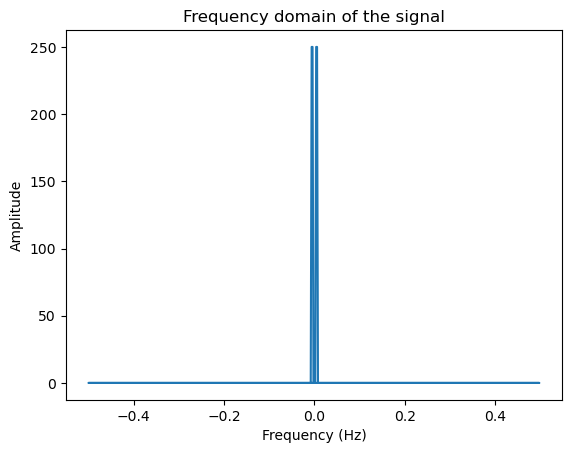
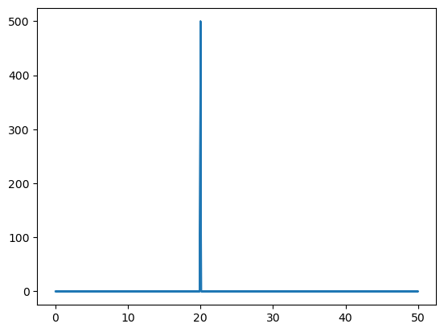

# 複數（Complex Numbers）

- 支持所有的基本數學運算（加、減、乘、除），
- 不支持比較運算（<、>、<=、>=）
- 可比較兩個複數的絕對值，也就是他們距離原點的距離

<br>

1. 基本宣告與運算


    ```python
    # 創建複數
    z1 = 3+5j
    z2 = 10-2j

    # 複數也可以用內建的 complex() 函數來創建
    z = complex(3, 5)  # 創建複數 3+5j

    # 獲取複數的實數部分和虛數部分，其中 `real` 與 `imag` 是 @property method
    real = z1.real  # 結果是：3.0
    imag = z1.imag  # 結果是：5.0

    # 對複數進行算術運算
    z3 = z1 + z2  # 結果是：(13+3j)
    z4 = z1 - z2  # 結果是：(-7+7j)
    z5 = z1 * z2  # 結果是：(40+40j)
    z6 = z1 / z2  # 結果是：(0.24+0.52j)
    ```

</br>

2. 可比較兩個複數的絕對值，也就是他們距離原點的距離


    ```python
    # 可比較兩個複數的絕對值，也就是他們距離原點的距離
    z1 = 3+5j
    z2 = 10-2j
    abs(z1)  # 結果是：5.830951894845301
    abs(z2)  # 結果是：10.198039027185569

    # z1 > z2  # 會報錯，因為複數不能比較大小
    # 比較絕對值
    abs(z1) > abs(z2)  # 結果是：False
    ```
    _結果_
    ```bash
    False
    ```

</br>

3. 複數的乘法

    _說明_
  
   - 尤其注意「複數的平方=-1」 ->j^2 = -1
     
   - z1 * z2 = (a + bj) * (c + dj)
     
   - = a*c + a*dj + bj*c + bj*dj
     
   - = a*c + a*dj + b*cj - b*d  （因為 j^2 = -1）
     
   - = (a*c - b*d) + (a*d + b*c)j

</br>

4. 共軛複數

    _在數學和物理中，共軛 `Conjugate` 有許多重要的用途，特別是在處理複數時。以下是一些共軛的主要用途和含義_

      - 計算複數的模（magnitude）或絕對值：複數 z = a + bi 的模定義為 sqrt(a² + b²)，這可以用 z 和其共軛 z* 的乘積的平方根來計算。即 |z| = sqrt(z * z*)。
      - 簡化複數分數：共軛在複數分數的簡化中很有用。當我們需要除以一個複數時，我們可以用分子和分母都乘以該複數的共軛，使得分母變為實數，這樣就可以簡化我們的計算。
      - 物理學中的應用：在物理學中，特別是在量子力學中，共軛也有其重要的應用。共軛可以幫助我們處理與波函數和概率相關的問題。例如，在計算一個波函數的概率密度（Probability Density）時，我們通常需要將該波函數與其自身的共軛相乘。
      - 信號處理和控制系統：在信號處理和控制系統中，共軛也有重要的應用。例如，我們可以使用共軛來分析和設計濾波器和控制器。

    _所以，儘管 `共軛` 這個詞在不同的上下文中可能有著不同的細微含義，但是其基本的概念是相同的，即對某個數量進行某種變換，這種變換在某種程度上反映了原始數量的特性。_


    ```python
    # 複數的共軛複數
    z1 = 3+5j
    z2 = 10-2j
    z1.conjugate()  # 結果是：(3-5j)
    z2.conjugate()  # 結果是：(10+2j)
    # conjugate() 函數會返回一個新的複數，不會改變原來的複數
    ```

</br>

5. 傅立葉轉換 `Fourier Transform`

   - 在某些專門的領域，如信號處理或者量子物理中，複數的應用就非常廣泛了。

   - Fourier Transform 是一種將信號從時間域轉換到頻域的方法。在 Python 中可以使用 numpy 庫來執行 Fourier Transform，而結果會是複數。

   - 以下是兩個在信號處理中使用複數的簡單示例，使用Python中的numpy庫來創建了一個包含兩種頻率的信號，並使用 Fourier Transform 進行頻譜分析。結果是一系列的複數，這些複數的絕對值表示各頻率分量的幅度，而複數的角度表示相位。

    <br>

    _範例一_
    
    ```python
    # Path: ex101_02_傅立葉轉換.ipynb
    import numpy as np
    import matplotlib.pyplot as plt

    # 時間參數
    t = np.linspace(0, 1, 500, endpoint=False)

    # 建立一個複數信號
    signal = np.cos(2 * np.pi * 3 * t) + 1j * np.sin(2 * np.pi * 2 * t)

    # 執行傅立葉轉換
    fft = np.fft.fft(signal)

    # 產生頻率範圍
    freq = np.fft.fftfreq(t.shape[-1])

    # 繪製傅立葉轉換的結果
    plt.figure()
    plt.plot(freq, np.abs(fft))
    plt.title("Frequency domain of the signal")
    plt.xlabel("Frequency (Hz)")
    plt.ylabel("Amplitude")
    plt.show()
    ```
    _結果_
    ```bash
    Intel MKL WARNING: Support of Intel(R) Streaming SIMD Extensions 4.2 (Intel(R) SSE4.2) enabled only processors has been deprecated. Intel oneAPI Math Kernel Library 2025.0 will require Intel(R) Advanced Vector Extensions (Intel(R) AVX) instructions.
    Intel MKL WARNING: Support of Intel(R) Streaming SIMD Extensions 4.2 (Intel(R) SSE4.2) enabled only processors has been deprecated. Intel oneAPI Math Kernel Library 2025.0 will require Intel(R) Advanced Vector Extensions (Intel(R) AVX) instructions.
    ```

    

    <br>
    
    _範例二_

    ```python
    import numpy as np
    import matplotlib.pyplot as plt

    # Create a simple signal with two frequencies
    dt = 0.01  # sampling interval
    Fs = 1 / dt  # sampling frequency
    t = np.arange(0, 10, dt)

    # generate signal
    signal = np.sin(2*np.pi*50*t) + np.sin(2*np.pi*120*t)  # Sum of 2 frequencies
    fourier_transform = np.fft.fft(signal)

    # calculate absolute value of result to get magnitude
    frequencies = np.fft.fftfreq(signal.size, dt)
    plt.plot(np.abs(frequencies), np.abs(fourier_transform))
    plt.show()
    ```
    
    
    
<br>


---

END
