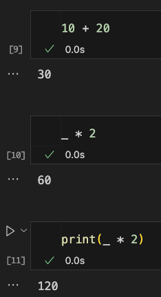

# 下底線

_在多種程式語言中，都有針對下底線的官方規定用法以及約定成俗用法_

<br>

## Python 中的用法

單底線（`_`）和雙底線（`__`）前綴在命名變量和方法時有特殊的含義

<br>

### 1. 單底線前綴 `_variable`

這通常被用作一種 `約定`，表明這個變量或方法是供內部使用的。這只是一種 `提示`，並不影響外部代碼訪問這個變量或方法的權限，只是提示其他開發者應該避免直接訪問這個變量或方法。

```python
class MyClass:
    def __init__(self):
        self.public = "public"
        self._protected = "protected"

obj = MyClass()
print(obj.public)      # 正常訪問
print(obj._protected)  # 正常訪問，但是不建議
```

_OUTPUT_

```bash
public
protected
```

<br>

### 2. 單底線後綴 `variable_`

為了避免與關鍵字有命名衝突的慣用方式。

```python
def print(class_):  # 用底線避免與關鍵字 class 衝突
    print(class_)
```

<br>

### 3. 雙底線前綴 `__variable`

這會觸發 `名字改寫`，在類別中的 `__variable`會被改寫為 `_Classname__variable`，這是為了防止 `子類意外重寫基類` 的私有字段和方法的機制。

```python
class MyClass:
    def __init__(self):
        self.__private = "private"

obj = MyClass()
#
try:
    # 會拋出異常，因為 __private 已被改寫為 _MyClass__private
    print(obj.__private)
except AttributeError as e:
    print(e)
#
print(obj._MyClass__private)  # 正確訪問方式
```

_OUTPUT_

```bash
'MyClass' object has no attribute '__private'
private
```

<br>

### 4. 雙底線前綴和後綴 `__variable__`

這種形式的變量被稱為 `魔法方法` 或 `特殊方法`。這些方法通常由 Python 的 `解釋器內部調用`，而不是直接由開發者的代碼調用。如 `__init__()` 用於初始化物件，`__call__()` 用於使一個物件可以像函數那樣被調用。

特殊方法的一個重要特點是，即使開發者不直接調用它，它也可以影響代碼的行為。這就是為什麼當創建一個新的物件或者像調用函數一樣調用它時，`__init__` 和 `__call__` 這類的方法會自動被調用。

_這裡示範 `__call__` 方法如何工作_

```python
class MyClass:
    def __call__(self, *args, **kwargs):
        # 可自訂邏輯，這裡輸出通知
        print("通知：類的物件以函數形式被調用了。")
        return "自訂返回值 Called"

obj = MyClass()
# 類的物件以函數形式被調用
result = obj()  # 觸發 __call__ 方法
print(result)
```

_OUTPUT_

```bash
通知：類的物件以函數形式被調用了。
自訂返回值 Called
```

_說明_

1. 上面的代碼定義了一個 `MyClass` 類，其中實作了 `__call__` 方法，這個魔法方法當物件 `obj` 被建立時，可以像調用函數那樣調用物件名稱，這時 `__call__` 方法會被調用，並依照自訂的邏輯運作，這個範例是輸出訊息 `通知：類的物件以函數形式被調用了。`，然後返回字串 `Called`。
2. 特殊方法通常不應由開發者的代碼直接調用，而是該讓 Python 的解釋器去調用它們，以實現特定的功能或行為。範例中進行實作 `__call__` 只是為了展示這個魔法方法會在哪個時點被解釋器調用，如果真的需要自己實作，應該完全理解它的作用和用法，以避免不必要的錯誤或問題。

<br>

### 5. 單底線 `_`

_說明_

1. 在 Python 中的單底線 `_` 有一個特殊的用法，就是它用來 `存儲上一個表達式的結果`。
2. 這對於快速測試和探索數據非常有用，尤其在進行數學運算或者調用返回值比較長的函數時，可以使用 `_` 來引用上一個操作的結果，而無需再次輸入整個表達式。

_舉例_

```python
10 + 20  # 假設這是剛執行的一個操作，結果是 30
```

_在這執行之後，可使用 `_` 來引用這個結果_

```python
result = _ * 2
print(result)  # 這將打印出 60，因為 _ 存儲了上一個表達式的結果 30
```

_OUTPUT_

```bash
60
```

_圖示_



_特別說明_

1. 這用法使得在交互式環境中快速進行計算和數據探索變得方便和高效，但僅在 `.ipynb` 這類的 Python 交互式環境中有效，而在普通的 Python 腳本或程序中使用 `_` 不會有效果。
2. 若在腳本中使用 `_`，通常代表 `故意忽略` 的意思，表示用不到這個變量或回傳值。

_用不到這個變量_

```python
for _ in range(5):
    print("Hello")  # 只想做五次，但毋需使用到計次的索引
```

_用不到這個回傳值_

```python
_, remainder = divmod(10, 3)
print(remainder)  # 1
```

<br>

## 名稱改寫機制

Python 中的 `名稱改寫` 是指當一個類別中的屬性或方法使用雙底線前綴（`__`）時，Python 解釋器會對其進行改寫，從而 `避免在繼承時可能發生的命名衝突`。

```python
class A:
    def __init__(self):
        self.__private = "私有變量"
        self.public = "公有變量"

class B(A):
    def __init__(self):
        super().__init__()
        self.__private = "子類的私有變量"  # 並不會覆蓋 A 中的 __private
        self.public = "子類的公有變量"  # 會覆蓋 A 中的 public

obj = B()
print(obj._A__private)  # 正確訪問 A 中的 __private
print(obj._B__private)  # 正確訪問 B 中的 __private
print(obj.public)       # 輸出：子類的公有變量
```

_說明_
在這個例子中，`B` 繼承自 `A`，它們都有一個名為 `__private` 的屬性。由於名稱改寫機制的存在，這兩個屬性並不會衝突，它們分別存儲在 `_A__private` 和 `_B__private` 中。

<br>

## 魔法方法 `__new__`

_特質說明_

1. 在 Python 中， `__new__` 是用於創建物件的 `魔法方法`，當物件被創建時 `__new__` 會被 `自動調用`，是物件創建過程中最先被執行的階段，也就是在 `__init__` 之前就會被執行。
2. `__new__` 的主要作用是控制物件的創建過程，它接受 `類` 作為其第一個參數，並返回類的一個實體，若實作的 `__new__` 有其他參數，無論是否有初始值或類的可變性，務必確保將參數傳遞給 `__init__`。
3. `不可變類型` 的物件因為 `建立後` 不可改變其值，而 `__new__` 會返回一個實體，所以可知在 `__init__` 階段對物件進行值的改變都將無法生效，但是不會發生例外，這會對物件添加了新的屬性，而不是沒有進行程序。
4. 無論 `__new__` 階段是否建立了物件的實體，只要沒有返回任何類的實體或返回 `None`，那麼 `__init__` 將不會被調用，這表示 `__new__` 已經完全控制了物件的建立流程，而自定義單例模式就是應用這個機制達成。
5. 補充前述，外部是無法訪問到 `__new__` 的內部，只能接收 `__new__` 所返回的實體，而 `__init__` 則是決定是否接收實體做初始化。

<br>

_使用情境_

1. 控制物件創建：通過重寫 `__new__` 方法，可以改變物件創建的過程，也就是決定物件如何被創建以及物件是否進入 `__init__` 階段。
2. 單例模式：用於確保某個類只有一個實體存在，通過重寫 `__new__` 方法，可以確保即使多次創建物件，也只返回同一個實體。
3. 繼承不可變類型：對於 Python 中的 `不可變內建類型` 如 `str`、`int` 和 `tuple`，如果想繼承這些類型並添加一些自定義功能，`必需要` 重寫 `__new__` 方法，因為 `__init__` 在這些類型物件的建立過程中雖然會被調用，也可以為實體添加屬性，但不能修改實體的內部狀態。
4. 當你嘗試在 __init__ 方法中修改不可變類型物件的值時，會產生錯誤。這是因為不可變類型（如字符串、元組等）的值一旦被創建，就不能再改變。下面是一個試圖在 __init__ 方法中修改不可變字符串的例子：

```python
# 自定義一個類，繼承了 str
class MyString(str):
    def __init__(self, value):
        super().__init__()  # 調用父類別的初始化方法
        self.value = value.upper()  # 嘗試修改字符串的值

# 這將引發錯誤，因為字符串是不可變的
try:
    my_str = MyString("Hello, World!")
    print(my_str)
except Exception as e:
    print(f"An error occurred: {e}")
```

下面是一個使用 `__new__` 的範例，演示了一個簡單的單例模式實現：

```python
class Singleton:
    _instance = None

    def __new__(cls):
        if cls._instance is None:
            print("Creating the object")
            cls._instance = super().__new__(cls)
        return cls._instance

singleton = Singleton()
new_singleton = Singleton()

print(singleton is new_singleton)  # True
```

在這個例子中，無論你創建了多少個 `Singleton` 類的實體，都只會有一個實體被創建，並且 `__new__` 方法中的打印語句只會執行一次。

<br>
---

_END_
