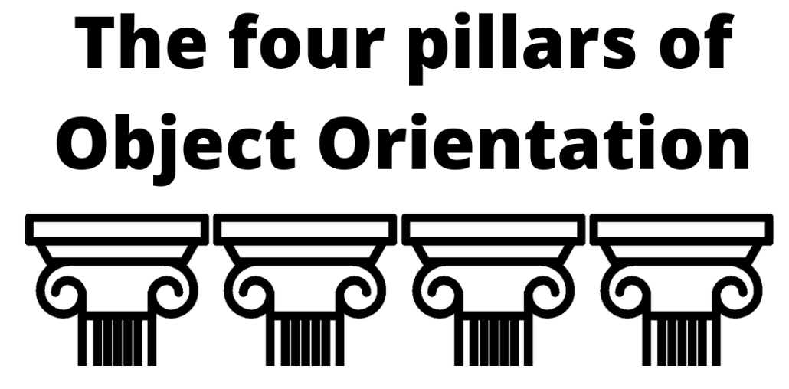
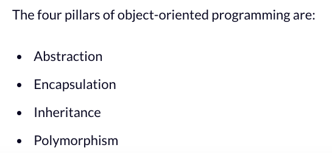

# Python 的物件導向

_Python 是一種支援多種程式設計範式（paradigm）的語言，其中包括物件導向程式設計（Object-Oriented Programming，OOP）。_

<br>

## OOP 的特性

1. 模組化：將程式碼分解成模組或類別，能輕易地在其他程式碼中重複調用（重用）。
2. 重用性：提供類別與繼承的概念，讓開發者可以重用和擴展現有的程式碼。
3. 封裝：允許使用者透過類別將相關的狀態（變數）和行為（方法）包裝起來，提供公共接口，而隱藏內部實現細節。
4. 抽象：可透過建立抽象基礎類別（ABS，abstract base classes）來實現抽象。這個特性允許開發者定義通用的介面，並在具體的子類別中實現該介面。
5. 多型（Polymorphism）：Python 是動態型別程式語言，所以其多型性主要是透過 `鴨子型別（duck typing）`實現的，也就是說一個物件的意義不是由繼承自哪個類別或者實現哪個介面決定，而是由它是否擁有特定方法或者行為決定的。

<br>

## 物件導向範式中的四根柱子



_抽象、封裝、繼承、多型_



<br>

## 以程式碼說明

1. 模組化：模組是指一個 `.py` 檔案，將類或函數包裝在模組內，可在其他模組中進行引用。

    （1）建立模組：建立一個檔案 `car.py`，為利於分辨使用小寫命名。
    ```python
    # car.py
    class Car:
        def build(self):
            print('車輛建造完成！')
    ```
    （2）在其他模組中引用
    ```python
    from car import Car

    my_car = Car()
    my_car.build()
    ```
    _結果_
    ```bash
    車輛建造完成！
    ```

<br>

2. 重用性：透過類別＋繼承來提高重用性。

   （1）透過 `繼承` 來示範
    
    ```python
    from car import Car

    # 定義一個電動車，繼承 Car
    class ElectricCar(Car):
        def charge(self):
            print('正在進行充電！')

    # 假如是一個主程式
    if __name__ == '__main__':
        new_car = ElectricCar()
        # 調用父類的函數
        new_car.build()
        # 調用自己的函數
        new_car.charge()
    ```
    _結果_
    ```bash
    車輛建造完成！
    正在近行充電！
    ```

<br>

3. 封裝：是指將 `資料` 和操作該資料的 `方法` 封裝在同一個類別中。
   
    ```python
    class Car2:
        #
        def __init__(self):
            # 這是一個私有屬性
            self.__fuel = 0

        # 添加一個加油的方法
        def add_fuel(self, amount):
            self.__fuel += amount
            # 每次加油後都會顯示新的油量
            print(f'為車子加油 {amount} 公升，目前的油量是 {self.__fuel}')

    if __name__ == '__main__':
        # 建立物件
        car2 = Car2()
        # 加油
        car2.add_fuel(10)
        # 再次加油
        car2.add_fuel(15)
    ```
    _結果_
    ```bash
    為車子加油 10 公升，目前的油量是 10
    為車子加油 15 公升，目前的油量是 25
    ```

<br>

4. 抽象（abstract）：抽象是建立一個基礎類別，但部分功能留給子類別去實現，父類僅需說到有這樣的功能即可。

    ```python
    from abc import ABC, abstractmethod

    class Vehicle(ABC):
        def __init__(self, make, model, year):
            self.make = make
            self.model = model
            self.year = year

        @abstractmethod
        def drive(self):
            pass

    class Car(Vehicle):
        def drive(self):
            print("Driving a car")

    class Truck(Vehicle):
        def drive(self):
            print("Driving a truck")

    car = Car("Honda", "Civic", 2019)
    truck = Truck("Ford", "F150", 2019)
    car.drive()
    truck.drive()
    ```
    _結果_
    ```bash
    Driving a car
    Driving a truck
    ```

<br>

6. 多型（Polymorphism）：Python 的多型是透過 `鴨子型別（Duck Typing）` 實現的。

    ```python
    # python 的多型
    # 多型是指一個對象可以被多個類型所兼容

    # 
    class Dog():
        # 
        def eat(self):
            print(self.name + " eat bone")

    # 
    class Cat():
        # 
        def eat(self):
            print(self.name + " eat fish")

    #
    def eat_something(entity):
        #
        entity.eat()

    # 建立兩個動物物件
    dog = Dog()
    dog.name = "dog"
    cat = Cat()
    cat.name = "cat"
    #
    eat_something(dog)
    eat_something(cat)
    ```
    _結果_
    ```bash
    dog eat bone
    cat eat fish
    ```

<br>

---

_END_
