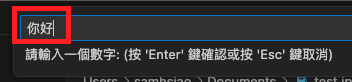
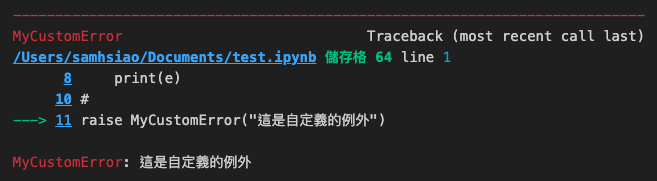
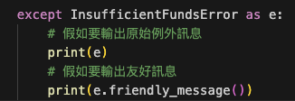

# 例外處理實作

    _從基礎到深入_

</br>


1. `除數為零` 會導致 `ZeroDivisionError`

    ```python
    x = 10 / 0 
    ```
    _OUTPUT_
    ```bash
    ZeroDivisionError: division by zero
    ```

</br>

2. 這會主動引發例外
    
    ```python
    try:
        raise ValueError("這是一個無效的值!")
    except ValueError as e:
        print(f"捕捉到錯誤：{e}")
    ```
    _OUTPUT_
    ```bash
    捕捉到錯誤：這是一個無效的值!
    ```

</br>

3. `使用正確的函數` 卻 `傳入錯的值` 所引發的錯誤

    ```python
    try:
        x = int(input("請輸入一個數字: "))
    except ValueError:
        print("這不是一個有效的數字!")
    ```
    _在上方的互動視窗中輸入 `你好`_

    

    _OUTPUT_
    ```bash
    這不是一個有效的數字!
    ```

</br>

4. 透過 `try-exception` 捕捉例外

    ```python
    try:
        x = int(input("請輸入一個數字: "))
    except ValueError as e:
        print(e)
        print("這不是一個有效的數字!")
    ```
    _OUTPUT_
    ```bash
    invalid literal for int() with base 10: 'good'
    這不是一個有效的數字!
    ```

</br>

5. 多個 except：捕捉多種不同的例外

    ```python
    while True:
        try:
            x = float(input("請輸入一個浮點數："))
            y = 10 / x
        except ZeroDivisionError:
            print("除以零!")   # 如果輸入是0
        except ValueError:
            print("這不是一個數字!")  # 如果輸入的不是一個數字
        except OverflowError:
            print("數值太大!")  # 如果輸入的數字非常大，以致於運算結果超過了能被表示的範圍
        except FloatingPointError:
            print("浮點運算錯誤!")  # 由於浮點數的某些計算問題而引發的異常
        except ArithmeticError:
            print("數學運算錯誤!")  # 其他未指定的數學錯誤
        else:
            print("答案是：", y)
        finally:
            if x == 999:
                print('結束迴圈')
                break
    ```
    _OUTPUT：請實測運行結果_


</br>

6. 測試 else、finnaly

    ```python
    try:
        y = 10 / int(input())
    except ZeroDivisionError:
        print("除以零!")
    except ValueError:
        print("這不是一個數字!")
    else:
        print(f'y 值等於 {y}')
    finally:
        print('程式碼執行完畢！')
    ```
    _OUTPUT_
    ```bash
    這不是一個數字!
    程式碼執行完畢！
    ```

</br>

7. 自訂義例外，繼承 Exception

    ```python
    class MyCustomError(Exception):
        pass

    # 引發自訂義例外
    try:
        raise MyCustomError("這是自定義的例外")
    except MyCustomError as e:
        print(e)
    ```
    _OUTPUT_
    ```bash
    這是自定義的例外
    ```
    _假如沒有捕捉例外_

    

</br>


8. 自定義例外類型

    _以下實作一個範例，用來模擬提款的邏輯_

    ```python
    class InsufficientFundsError(Exception):
        """當帳戶操作會導致餘額為負時引發此例外。"""
        pass

    class InvalidAmountError(Exception):
        """當提供的金額無效時（例如為負數）引發此例外。"""
        pass

    class BankAccount:
        def __init__(self, initial_balance):
            self.balance = initial_balance

        def withdraw(self, amount):
            if amount < 0:
                raise InvalidAmountError("提款金額必須為正數！")
            
            if self.balance - amount < 0:
                raise InsufficientFundsError("您的餘額不足！")
            
            self.balance -= amount
            return self.balance

    # 問帳戶餘額
    initial_balance = float(input("請輸入您開戶要存入的金額："))
    account = BankAccount(initial_balance)

    # 開戶後的訊息輸出
    print(f"恭喜您成功開戶！您的起始存款為：{account.balance} 元。")

    while True:
        try:
            # 詢問要提款多少
            amount_to_withdraw = float(input('請輸入要提款的金額（或輸入-1結束操作）：'))
            
            # 如果輸入-1，則結束操作
            if amount_to_withdraw == -1:
                print("提款操作已結束。")
                break
            
            account.withdraw(amount_to_withdraw)
            print(f"您已成功提款 {amount_to_withdraw} 元。")
            
        except InsufficientFundsError:
            print(f"您的提款金額 {amount_to_withdraw} 超出了您的目前餘額！")
        except InvalidAmountError:
            print(f"嘗試提款無效的金額：{amount_to_withdraw}")

        finally:
            print(f"您的餘額為：{account.balance} 元。\n")
    ```
    _OUTPUT：請實際操作觀察_

</br>

9. 實作自訂義例外類型：在原有功能基礎上，加入新的自訂異常和友善的錯誤訊息功能。

    ```python
    class InsufficientFundsError(Exception):
        """當賬戶操作會導致餘額為負時引發此例外。"""

        def __init__(self, amount, balance):
            super().__init__(f"提款金額 {amount} 超出了您的目前餘額 {balance}！")
            self.amount = amount
            self.balance = balance

        def friendly_message(self):
            return f"很抱歉，您目前只有 {self.balance} 元，但您希望提取 {self.amount} 元。"

    class InvalidAmountError(Exception):
        """當提供的金額無效時（例如為負數）引發此例外。"""

        def __init__(self, amount):
            super().__init__(f"提款金額必須為正數，但您提供了 {amount} 元。")
            self.amount = amount

    class BankAccount:
        def __init__(self, initial_balance):
            self.balance = initial_balance

        def withdraw(self, amount):
            if amount < 0:
                raise InvalidAmountError(amount)
                
            if self.balance - amount < 0:
                raise InsufficientFundsError(amount, self.balance)
                
            self.balance -= amount
            return self.balance

    # 問帳戶餘額
    initial_balance = float(input("請輸入您開戶要存入的金額："))
    account = BankAccount(initial_balance)

    # 開戶後的訊息輸出
    print(f"恭喜您成功開戶！您的起始存款為：{account.balance} 元。")

    while True:
        try:
            # 詢問要提款多少
            amount_to_withdraw = float(input('請輸入要提款的金額（或輸入-1結束操作）：'))
            
            # 如果輸入-1，則結束操作
            if amount_to_withdraw == -1:
                print("提款操作已結束。")
                break
            
            account.withdraw(amount_to_withdraw)
            print(f"您已成功提款 {amount_to_withdraw} 元。")
                
        except InsufficientFundsError as e:
            # 假如要輸出原始例外訊息
            print(e)
            # 假如要輸出友好訊息
            print(e.friendly_message())
        except InvalidAmountError as e:
            print(str(e))

        finally:
            print(f"您的餘額為：{account.balance} 元。\n")
    ```

    _OUTPUT：請實作觀察，這裡要特別說明的是原始訊息與友善訊息_

     

<br>

---

_END_