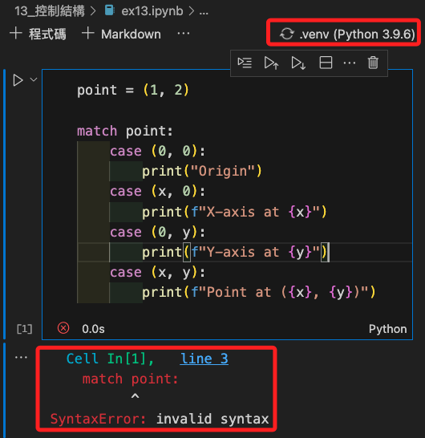
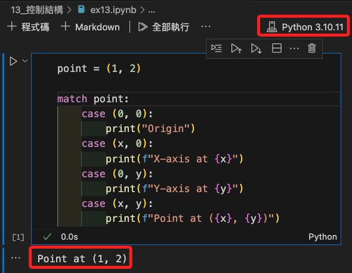

# `match` 

_可參考官方文件中 [Control Flow Tools](https://docs.python.org/3/tutorial/controlflow.html#more-control-flow-tools) 的 4.6 [match Statements](https://docs.python.org/3/tutorial/controlflow.html#match-statements)_

<br>

## 說明

1. `match` 是 Python 3.10 引入的 _結構化模式匹配_，假如使用 `3.10` 以前的版本，會出現以下 `SyntaxError` 訊息。

    

    _切換核心之後便可正確運行_

    

<br>

2. 這是一種新的控制流結構，類似於其他語言中的 `switch-case` 語句，它不僅可以匹配簡單的值，還可以基於物件的結構和內容來進行更複雜的條件檢查，也就是可以解構（destructure）數據並根據數據的結構執行不同的代碼塊，例如解構列表、數組或類。

<br>

3. 基本語法結構。

    ```python
    match 變數:
        case 模式1:
            # 執行模式1相關的代碼
        case 模式2:
            # 執行模式2相關的代碼
        case _:
            # 如果以上模式都不匹配，執行此代碼塊
    ```

<br>

4. 特性。

   - 值匹配：可以直接匹配變數的值。
   - 模式解構：可以解構列表、元組等數據結構。
   - 守衛語句：if 能夠用於進一步細化匹配條件。
   - 捕獲變數：在模式中指定的變數可以在 case 塊中使用。

<br>

## 範例

1. 匹配字面量。

    ```python
    status_code = 404

    # 封裝為函數
    def http_error(status):
        match status:
            case 200:
                return "Success!"
            case 400:
                return "Bad request"
            case 404:
                return "Not Found."
            case 418:
                return "I'm a teapot"
            case 500:
                return "Server Error"
            # _ 作為萬用字元，匹配任何未被前面 case 匹配的情況。
            case _:
                return "Something's wrong with the internet"
    # 調用函數
    http_error(404)
    ```
    _結果_
    ```bash
    Not Found.
    ```

<br>

_以下 2、3、4 點使用了類似的範例，但在數據的定義上略有不同。_

<br>

2. 解構賦值：解構數組和列表，並可以將值綁定到變量；在以下範例中，每個 case 可以解構 point 的值，並根據其內容選擇不同的執行路徑。

    ```python
    point = (1, 2)

    match point:
        case (0, 0):
            print("Origin")
        case (x, 0):
            print(f"X-axis at {x}")
        case (0, y):
            print(f"Y-axis at {y}")
        case (x, y):
            print(f"Point at ({x}, {y})")
        case _:
            raise ValueError("Not a point")
    ```
    _結果_
    ```bash
    Point at (1, 2)
    ```

<br>

3. 類模式匹配：手動定義了初始化方法，如此可以在初始化時加入更多的邏輯處理。

    ```python
    class Point:
        def __init__(self, x, y):
            self.x = x
            self.y = y

    def where_is(point):
        match point:
            case Point(x=0, y=0):
                print("Origin")
            case Point(x=0, y=y):
                print(f"Y={y}")
            case Point(x=x, y=0):
                print(f"X={x}")
            case Point():
                print("Somewhere else")
            case _:
                print("Not a point")

    # 建立點
    point1 = Point(0, 0)
    point2 = Point(0, 5)
    point3 = Point(3, 0)
    point4 = Point(3, 4)
    point5 = "not a point object"

    # 測試
    where_is(point1)
    where_is(point2)
    where_is(point3)
    where_is(point4)
    where_is(point5)
    ```
    _結果_
    ```bash
    Origin
    Y=5
    X=3
    Somewhere else
    Not a point
    ```

<br>

4. 解構數組：使用 Python 的 dataclasses 模組來定義 Point 類，這可以自動為類提供初始化方法、__repr__ 方法等，進而簡潔了語句，這種定義方式適合用於存儲數據並且不需要額外方法的簡單類。

    ```python
    from dataclasses import dataclass

    @dataclass
    class Point:
        x: int
        y: int

    def process_point(point):
        match point:
            case Point(x=0, y=0):
                print("Origin")
            case Point(x=0, y=y):
                print(f"Y-axis at {y}")
            case Point(x=x, y=0):
                print(f"X-axis at {x}")
            case Point():
                print(f"Point at ({point.x}, {point.y})")
            case _:
                print("Not a point")

    '''建立物件並調用函數'''
    # 物件一
    p1 = Point(0, 0)
    process_point(p1)

    # 物件二
    p2 = Point(0, 5)
    process_point(p2)

    # 物件三
    p3 = Point(7, 0)
    process_point(p3)

    # 物件四
    p4 = Point(3, 4)
    process_point(p4)
    ```
    _結果_
    ```bash
    Origin
    Y-axis at 5
    X-axis at 7
    Point at (3, 4)
    ```

<br>

5. 使用守衛 `guard`：是在 match 語句中透過 if 條件來進一步限制模式匹配的一個進階用法。 守衛可以讓你在滿足基本模式匹配的基礎上，添加額外的條件判斷，只有當這些條件也被滿足時，才執行對應的程式碼區塊。。

    ```python
    def check_user_access(user):
        match user:
            case {"name": name, "age": age} if age >= 18:
                print(f"{name} has access")
            case {"name": name, "age": age}:
                print(f"{name} does not have access because of age {age}")
            case _:
                print("Invalid user data")

    #
    users = [
        {"name": "Alice", "age": 22},
        {"name": "Bob", "age": 17},
        {"name": "Charlie", "age": 18},
        {"name": "Daisy"}  # 缺少年龄信息
    ]
    for user in users:
        check_user_access(user)
    ```
    _結果_
    ```bash
    Alice has access
    Bob does not have access because of age 17
    Charlie has access
    Invalid user data
    ```

<br>

6. 匹配類型。

    ```python
    def process(value):
        match value:
            case str():
                print("This is a string")
            case int():
                print("This is an integer")
            case list():
                print("This is a list")
            case _:
                print("Unknown type")

    #
    process(1)
    #
    process('Hello')
    #
    process([1, 2, 3])
    #
    process(True)
    ```
    _結果_
    ```bash
    This is an integer
    This is a string
    This is a list
    This is an integer
    ```

<br>

7. `match` 搭配使用 `|`：在 Python 的 match 語句中，使用 `|` 符號可表示 `or`，允許在單一 case 語句中組合多個字面值，這種用法實質上是一種模式匹配的簡寫，允許一個 case 分支匹配多個可能的值。

    ```python
    def check_status(code):
        match code:
            case 401 | 403 | 404:
                return "Not allowed"
            case 200:
                return "OK"
            case _:
                return "Unknown code"

    #
    check_status(403)
    ```
    _結果_
    ```bash
    'Not allowed'
    ```

<br>

___

_END_
