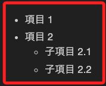
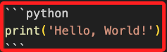

# Markdown 語法彙整

[官方文件](https://www.markdownguide.org/getting-started/)

<br>

## 說明

1. 輕量級 `標記語言` ，可以轉換為 `HTML` ，用於控制文本的格式。

<br>

2. 假如要查看 `Markdown` 原碼，請點擊右上角的 `Raw` 。

<br>

## 表格

1. 在 Jupyter 的 Markdown 單元中繪製表格可以直接使用 Markdown 語法。

    ```bash
    | 頭部1  | 頭部2  |
    |-------|--------|
    | 資料1  | 資料2  |
    | 資料3  | 資料4  |
    ```

<br>

## 插入圖片

1. 範例。

    ```bash
    
    ```

<br>

## 建立超連結

1. 範例。

    ```bash
    [Google](https://www.google.com/)
    ```

<br>

## 建立數學公式

1. Jupyter 的 Markdown 支持 LaTeX 數學公式，可以使用兩個美元符號來建立一個獨立的公式，但 Github 並不直接支援而未能正確顯示，這裡暫時省略。

    ```bash
    $$
    f(x) = x^2
    $$
    ```

<br>

2. 這是一個行內公式。

    ```bash
    \($e^{i\pi}$ + 1 = 0\)
    ```

<br>

3. 也可使用語法結構。

    ```bash
    $$
    e^{i\pi} + 1 = 0
    $$
    ```

<br>

4. 或使用一個美元符號來建立內嵌的公式，在左右兩邊加上 `$`；假如要忽略 `$` 或 `&&` 要加上 _```markdown_ 裝飾字。

    ```bash
    $x^2$
    ```

<br>

## 建立列表

1. 可以使用星號、加號或是短橫線來建立無序列表。

    ```bash
    - 項目 1
    - 項目 2
        - 子項目 2.1
        - 子項目 2.2
    ```

    

<br>

2. 建立包含子列表的有序列表，特別注意，不同的 Markdown 渲染器有不同的顯示方式，可實測觀察這樣的設置是否有效，並選擇適當的列表渲染。

    ```bash
    1. 有序項目 1
    2. 有序項目 2
        1. 子項目 2.1
        2. 子項目 2.2
    ```

<br>

3. 建立待辦列表。

    ```bash
    - [ ] 待辦事項1
    - [x] 已完成事項1
    ```

<br>

## 標題

1. 最多就六個 `#`。

    ```bash
    ### 標題 1

    #### 標題 2

    ##### 標題 3

    ###### 標題 4
    ```

<br>

## HTML

1. 在 `.ipynb` 中運行一般的 HTML 語法。

  `<u>`底線文字 `</u>`

<br>

2. 假如在 `.ipynb` 中的 `MARKDOWN` CELL 運行會顯示紅色文字。

    ```bash
    <div style="color: red">這是紅色文字。</div>
    
    <div style="color: red">這在 .ipynb 的 .md 中顯示會是紅色文字。</div>

    <span style="color:red">這在 .ipynb 的 .md 中顯示會是紅色文字。</span>
    ```

    

<br>

## 縮排

1. 範例一。

    ```bash
    &nbsp;&nbsp;(1)這是一段縮排的文字。
    ```

<br>

2. 範例二。

    ```bash
    <blockquote>
    (2)這是一段縮排的文字。
    </blockquote>
    ```

<br>

3. 範例三。

    ```bash
    > (3)這是一段縮排的文字。
    ```

<br>

4. 範例四。

    ```bash
    <p style="margin-left: 40px;">
    (4)這是一段縮排的文字。
    </p>
    ```

<br>

## 引言 Blockquote

1. 引言本身也是一種縮排，另外，多層引言的層級數量並無上限。

    ```bash
    > 這是一層引用

    >> 這是二層引用

    >>> 這是三層引用
    ```

<br>

## 代碼區塊

1. 在代碼的上下行分別使用三個反引號 `` ``` ``。

    

<br>

2. 特別注意，在 `Markdown 格式` 的中的反引號 `` ` `` 稱為 `backticks`，若要 `展示` 多個連續的反引號時，例如要在 Markdown 文本顯示出三個用於代碼塊的反引號 `` ``` ``），這時需要使用技巧來 `逃逸` 它們，以使其被當作普通文本顯示。

<br>

3. 顯示單個反引號，使用雙反引號將單個反引號包裹起來。

    ```bash
    `` ` ` ``
    # 或
    `` ` ``
    ```
<br>

4. 顯示三個反引號，使用四個反引號開始和結束，然後在中間放三個反引號。

    ```bash
    `` ``` ``
    ```

<br>

5. 可在程式碼區塊加註使用的語言標識如 `python`、`bash` 等之後會使語法高亮；實際可用的語言標識取決於使用的 Markdown 渲染器和它所依賴的語法高亮庫。常見的渲染器如 GitHub Flavored Markdown（GFM）依賴於 Pygments 或 highlight.js 等語法高亮庫。

    _常見的語言標識及其對應的中文名稱_

    | 語言標識     | 中文名稱   |
    | ----------- | ---------- |
    | `markdown`  | markdown   |
    | `python`    | Python     |
    | `bash`      | Bash 腳本  |
    | `shell`     | Shell 腳本 |
    | `ini`       | INI 設定檔 |
    | `java`      | Java       |
    | `c`         | C 語言     |
    | `cpp`       | C++        |
    | `js`        | JavaScript |
    | `html`      | HTML       |
    | `css`       | CSS        |
    | `sql`       | SQL        |
    | `ruby`      | Ruby       |
    | `php`       | PHP        |
    | `json`      | JSON       |
    | `xml`       | XML        |
    | `yaml`      | YAML       |
    | `bash` | 純文本     |

<br>

## 反斜線 `\` 轉義符號的用法

1. 主要功能是將具有特殊意義的字符如 `*`、 `_`、 `#` 等被視為普通文本字符，而不是用於格式化的字符。

    ```bash
    # 顯示星號而不是格式化為斜體字 
    \*
    # 顯示井號而不是將其用作標題 
    \#
    ```

<br>

## 斜體

1. ` * ` 或 ` \ ` 用於斜體。

    ```bash
    *這是斜體*

    _這也是斜體_
    ```

<br>

## 粗體

1. ` ** ` 或 ` __ ` 用於加粗。

    ```bash
    **這是加粗**

    __這是加粗__
    ```

<br>

## 分隔線

1. 三個或更多的減號 `-` 或星號 `*` 符號。

    ```bash
    ---------------------
    # 或
    ---
    # 或
    ***
    ```

<br>

___

_END_
